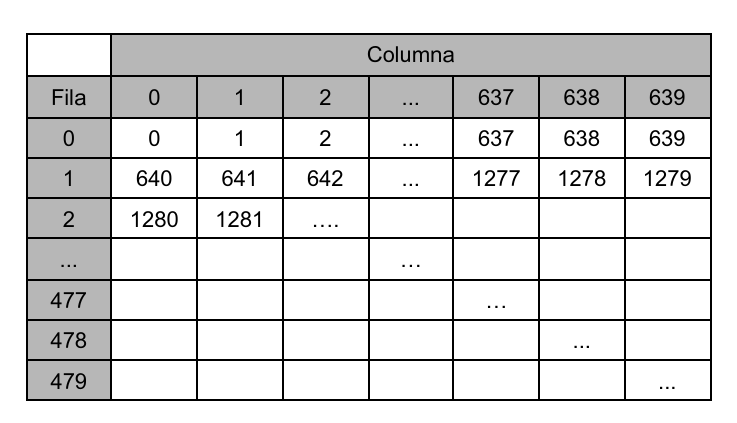
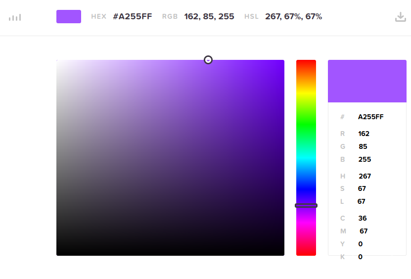

[](ARMv8_Reference_Manual.pdf)
[](https://www.qemu.org/)
[](https://www.raspberrypi.org/)
[](https://pypi.org/project/Pillow/)
[](https://pypi.org/project/Pillow/)

# Vc framebuffer
Framebuffer to the graphics device access method of a computer system, in which each pixel on the screen is represented as locations of a specific portion of the random access memory map (main memory system)

# Debian Based Instalation
`sudo apt update`

`sudo apt install gcc-aarch64-linux-gnu`

`sudo apt install qemu-system-arm`

`sudo apt install gdb-multiarch`

`wget -P ~ git.io/.gdbinit`

# Commands
> Check QEMU version:

`apt show qemu-system-x86`

> Check Python version:

`python3 --version` or `python --version`

> Makefile
- `make clean`: removes compiled images **[ALLWAYS]**
- `make run`: run QEMU in new window **[WITHOUT DEBUG]**
- `make runQEMU`: after `make clean` before `make runGDB` **[DEBUG]**
- `make runGDB`: after `make runQEMU` need to use in other console (remember path) **[DEBUG]**
- `make remake`: run `make clean` then `make run`


# How to debug

`stepi`

Do breakpoint

`b`

`continue`

`info b`

`delete b`

# Pixels
> Resolution size: `640x480` `pixels`

> Format: `ARGB`, `32 bits`

The screen pixels are stored in a vertical framebuffer ordered *row by row*, with the 1st pixel being the top most left one.

The frame buffer stores each pixel as a **4 byte** (32 bits) cell that encodes the color of that pixel.

<p align="center">
  
</p>

# Colours
> Important: colours have 24bits.

**R** = `162` = `10100010`

**G** = `85` = `01010101`

**B** = `255` = `11111111`

```as
setColour:
	// Return
	// x18 Color a pintar
	// Args
	// x13 r
	// x14 g
	// x15 b
	// 24 bits
	lsl x13, x13, 16			// Movemos 16 bits
	lsl x14, x14, 8				// Movemos 8 bits
	add x18, x13, x14			// R+G
	add x18, x18, x15			// RG+B
	ret
```

```js
   101000100000000000000000 (r) -> 24 bits
+         01010101000000000 (g) -> 24 bits
+                  11111111 (b) -> 24 bits
```

<p align="center">
  
</p>

# Partial animation
`circleAnimation1`

<video width="800" height="450" controls>
  <source src="assets/video/circleAnimation1.mkv">
Your browser does not support the video tag.
</video>

#  Files

**[start.s](start.s)** **→** initialization of hardware

**[app.s](app.s)** **→** "main"

**[baseCore.s](baseCore.s)** **→** low level abstractions for framebuffer manipulation

**[draw.s](draw.s)** **→** basic lines and figures

**[font.s](font.s)** **→** upper case and lower case

**[animations.s](animations.s)** **→** delay

**[aScreenAnimations.s](aScreenAnimation.s)** **→** screen animations (animations across the screen)

**[todo.md](todo.md)**

**[zowl.s](zowl.s)** **→** Pixel Art
<p align="center">
  
</p>

**[zraven.s](zraven.s)** **→** Pixel Art
<p align="center">
  
</p>

#  Links
## Raspberry Pi
https://www.raspberrypi.org/

## Pillow
https://pypi.org/project/Pillow/

##  Krita
https://krita.org/en/

# Visual Studio Extensions
https://marketplace.visualstudio.com/items?itemName=ExodiusStudios.comment-anchors

https://marketplace.visualstudio.com/items?itemName=aaron-bond.better-comments

https://marketplace.visualstudio.com/items?itemName=dan-c-underwood.arm

# Authors

- Gimenez, Diego ([@diegogimenez04](https://github.com/diegogimenez04))

- Vispo, Valentina ([@shirosweets](https://github.com/shirosweets))
