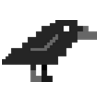

# vc-framebuffer
Framebuffer to the graphics device access method of a computer system, in which each pixel on the screen is represented as locations of a specific portion of the random access memory map (main memory system)

# Instalation
`sudo apt update`

`sudo apt install gcc-aarch64-linux-gnu`

`sudo apt install qemu-system-arm`

`sudo apt install gdb-multiarch`

`wget -P ~ git.io/.gdbinit`

# Commands
> Check QEMU version:

`apt show qemu-system-x86`

> Check Python version:

`python3 --version` or `python --version`

> Makefile
- `make clean`: removes compiled images **[ALLWAYS]**
- `make run`: run QEMU in new window **[WITHOUT DEBUG]**
- `make runQEMU`: after `make clean` before `make runGDB` **[DEBUG]**
- `make runGDB`: after `make runQEMU` need to use in other console (remember path) **[DEBUG]**
- `make remake`: run `make clean` then `make run`

# How to debug

`stepi`

Do breakpoint

`b`

`continue`

`info b`

`delete b`

# Pixels

  

#  Files
[app.s](app.s) -> "main"

[start.s](start.s)

[todo.md](todo.md)

[owl.s](owl.s) -> Pixel Art

  

[raven.s](raven.s) -> Pixel Art

  

#  Links
## Raspberry Pi
https://www.raspberrypi.org/

## Pillow
https://pypi.org/project/Pillow/

##  Krita
https://krita.org/en/

# Visual Studio Extensions
https://marketplace.visualstudio.com/items?itemName=ExodiusStudios.comment-anchors

https://marketplace.visualstudio.com/items?itemName=aaron-bond.better-comments

https://marketplace.visualstudio.com/items?itemName=dan-c-underwood.arm

# Authors

- Gimenez, Diego ([@diegogimenez04](https://github.com/diegogimenez04))

- Vispo, Valentina ([@shirosweets](https://github.com/shirosweets))
